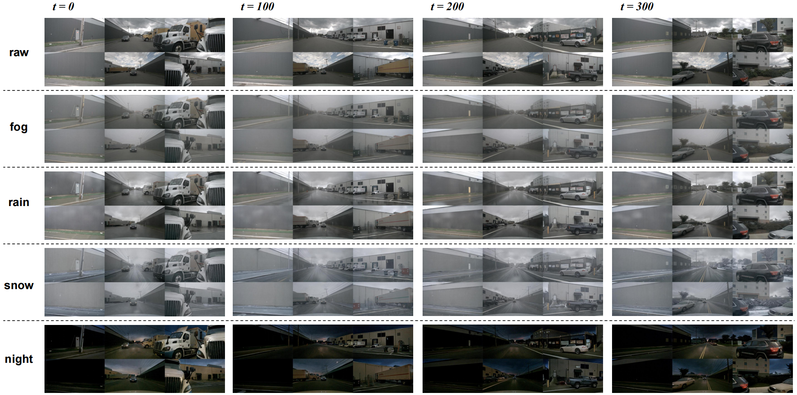
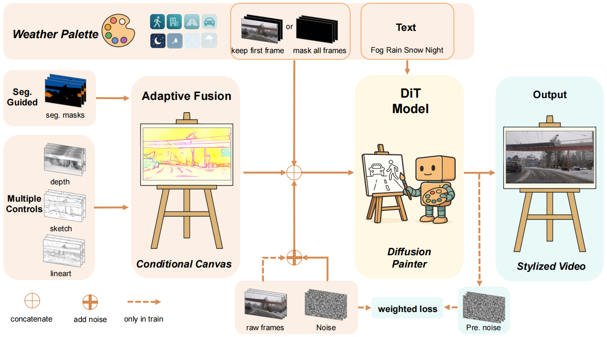

<div align="center">
    <h1>
    AutoAWG: Adverse Weather Generation
    </h1>
    <p>
    Official PyTorch code for <em>AutoAWG: Adverse Weather Generation with Adaptive Multi-Controls for Automotive Videos</em><br>    </p>
    </p>
    <a href="https://arxiv.org/abs/2604.18993"></a>
    <a href="https://doi.org/10.1145/3805622.3810849" target='_blank'></a>
    <a href='https://huggingface.co/HigherHu/AutoAWG'></a>
    <a href="https://www.apache.org/licenses/LICENSE-2.0"></a>


⭐ If AutoAWG is helpful to your projects, please help star this repo. Thanks! 🤗

</div>

**TL;DR:** AutoAWG is a novel framework for transfering multi-view videos to adverse weather conditions.



## Overview

We present **AutoAWG**, a controllable **A**dverse **W**eather video **G**eneration framework for **Auto**nomous driving. Our method employs a semantics-guided adaptive fusion of multiple controls to balance strong weather stylization with high-fidelity preservation of safety-critical targets; leverages a vanishing point-anchored temporal synthesis strategy to construct training sequences from static images, thereby reducing reliance on synthetic data; and adopts masked training to enhance long-horizon generation stability. Extensive qualitative and quantitative results demonstrate advantages in style fidelity, temporal consistency, and semantic--structural integrity, underscoring the practical value of **AutoAWG** for improving downstream perception in autonomous driving.



## Requirements
Before run, users need to download some pretrained weights and put them to `./checkpoints/`:
- download `best_deeplabv3plus_resnet101_cityscapes_os16.pth.tar` from [google drive](https://drive.google.com/file/d/1t7TC8mxQaFECt4jutdq_NMnWxdm6B-Nb/view)
- download `yolo11x-seg.pt` from [github](https://github.com/ultralytics/assets/releases/download/v8.3.0/yolo11x-seg.pt)
- download `alibaba-pai/CogVideoX-Fun-V1.5-5b-InP` from [hugging face](https://huggingface.co/alibaba-pai/CogVideoX-Fun-V1.5-5b-InP)
- download our trained `AutoAWG` model from [hugging face](https://huggingface.co/HigherHu/AutoAWG)

Also, you need to download the nuscenes dataset. For simplicity, you can download our processed samples from [google drive](https://drive.google.com/file/d/1rwwMAh9VELV6tXM2ELGOljZWICqZAXAT/view?usp=sharing) and unzip the downloaded `nuScenes_samples.zip` to `./data/` folder. Please ensure that the data path is consistent with the `INPUT_DATA` variable in `predict_nuscenes_6v.py`.

## Inference scripts
Then you can run the inference script:
> python predict_nuscenes_6v.py

In default, it will run a 45-frames generation for "snowy", "foggy", "night", "rainy" weather and the "same" weather as origin data. You can pass a parameter `--max_frames` to run a more frames generation. For example:
> python predict_nuscenes_6v.py --max_frames 500

Also you can modify the following code in line 274 to run partial weathers:
```
    all_weather = ['snowy', 'foggy', 'night', 'rainy', "same"]
```

ATTENTION: It will need more than 50GB GPU memory to run the inference.


## Citation

If you find our repo useful for your research, please consider citing our paper:

```bibtex
@inproceedings{hu2026autoawg,
   author={Hu, Jiagao and Zhou, Daiguo and Fu, Danzhen and Li, Fuhao and Wang, Zepeng and Wang, Fei and Liao, Wenhua and Xie, Jiayi and Sun, Haiyang},
   title={AutoAWG: Adverse Weather Generation with Adaptive Multi-Controls for Automotive Videos},
    booktitle    = {Proceedings of the 2026 International Conference on Multimedia Retrieval, {ICMR} 2026, Amsterdam, Netherlands, 16 - 19 June 2026},
    publisher    = {{ACM}},
    year         = {2026},
    url          = {https://doi.org/10.1145/3805622.3810849},
    doi          = {10.1145/3805622.3810849},
}
```